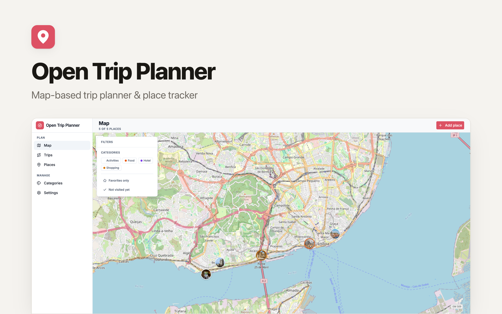

# OpenTripPlanner

[](https://app.clawnify.com/deploy?repo=clawnify/OpenTripPlanner)

Open-source **trip planner & map place tracker** — a self-hosted alternative to Wanderlog, TripIt, and Roadtrippers. Save the places you want to visit on an interactive map, track what you've seen and loved, and build day-by-day itineraries that draw your route across the map.

> Built on the [Clawnify](https://clawnify.com) template format. Deploy your own copy in minutes, customize freely, own the data.

## Features

### Map
- Full-bleed interactive map with every saved place as a **category-colored marker**
- **Right-click anywhere to add a place** — the spot's address is reverse-geocoded and pre-filled
- Marker popups show category, price, visited / favorite status, and a link
- Floating **filter panel**: multi-select categories, favorites-only, not-visited-yet
- Free **OpenStreetMap** tiles by default; set `MAPTILER_KEY` for crisper MapTiler tiles

### Places
- A table of every point of interest — category, visited / favorite, price (right-aligned, tabular)
- Rich place form: category, address with a **"Find" geocode button**, lat/lng, price + currency, 1–5 rating, notes, image, link
- Footer aggregate: how many you've visited and favorited

### Trips & itineraries
- Trip cards with cover, destination, date range, and day / stop counts
- **Day-by-day itinerary** — each day is a card listing ordered stops (place, category, arrive time, duration)
- Add stops from your saved places; **reorder** them with up / down controls
- A **mini map** on each trip draws its stops connected by a route polyline in order

### Categories
- Manage categories with a name, a color from the design palette, and a lucide icon
- Categories color markers and pills app-wide

## For agents

This app is built to be driven by an agent over its JSON API — geocode an address, drop a place, then assemble trips, days, and ordered stops without ever touching a browser. See [`agent.md`](./agent.md) for the full API and a planning recipe.

## Stack

- React 19 + Vite + TypeScript
- Tailwind CSS v4 + shadcn/ui (Radix primitives)
- **Leaflet + react-leaflet** for the map (OpenStreetMap / MapTiler tiles)
- Hono on Cloudflare Workers (D1-native — same code locally and in production)
- `lucide-react` for icons
- pushState URL routing

## Develop

```bash
pnpm install
pnpm dev          # Vite at :5173, Wrangler at :8787 (D1 schema applied automatically)
pnpm typecheck
pnpm build
```

The dev script applies `schema.sql` to the local D1 database, then runs Vite and Wrangler in parallel. On the first request into an empty database the app writes 4 categories, a sample "3 Days in Lisbon" trip and 5 Lisbon places (`src/server/seed.ts`), so it is usable on first boot.

## Configuration

| Env var | Required | Purpose |
|---------|----------|---------|
| `MAPTILER_KEY` | optional | Switches the base map from OpenStreetMap raster tiles to MapTiler's `streets-v2`. Omit it and the app uses free OSM tiles. |

## Deploy

If you have the Clawnify CLI installed:

```bash
clawnify deploy
```

Or wire it up to Cloudflare Workers + D1 directly using the bindings in `wrangler.toml` (binding `DB`, database name `open-trip-planner-db`).

## Project layout

```
schema.sql          Tables (DDL only)
src/
  server/
    index.ts        Hono routes (config, geocode, categories, pois, trips, days, stops, settings, stats)
    db.ts           D1 adapter (query / get / run)
    seed.ts         Sample data written into an empty database
  client/
    app.tsx         Shell + routing + agent-mode detection
    components/
      map/          The hero map, marker icon, click-to-add
      trips/        Trip list, trip detail, day cards, add-stop, mini map
      places/       Places table
      categories/   Category manager
      settings/     Map defaults + preferences
      ui/           Vendored shadcn primitives
    hooks/          use-router, use-app-state
    lib/            cn, color + pill helpers, lucide icon registry, date/money helpers
```

## License

MIT
